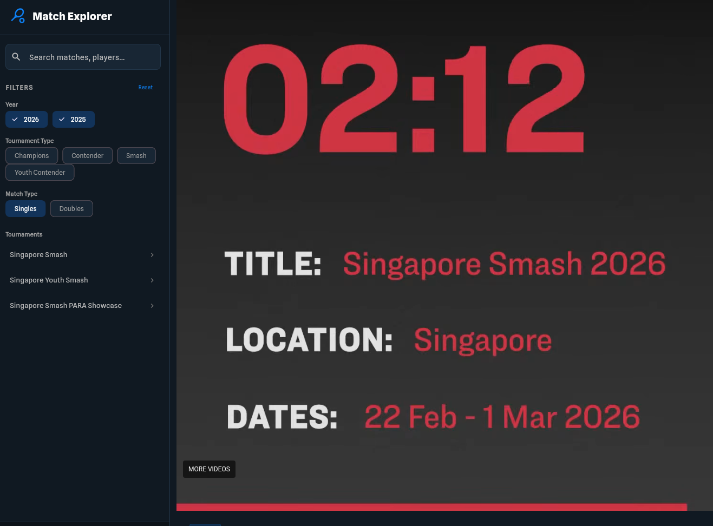
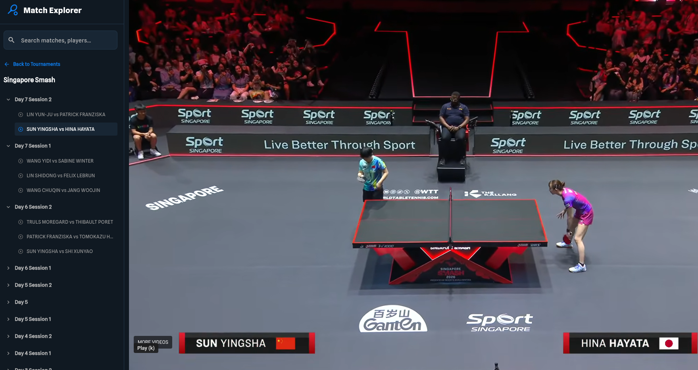
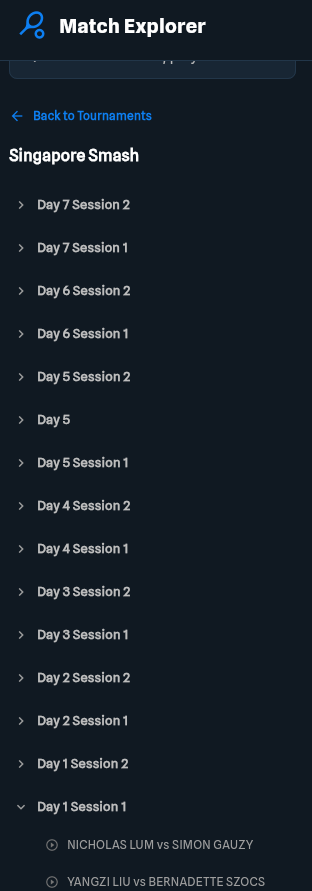

# Description
 Wtt-youtube-organizer is an application which makes watching ping pong matches published to [Wtt](https://worldtabletennis.com/) [youtube channel](https://www.youtube.com/@WTTGlobal/videos) more fun.

[Wtt](https://worldtabletennis.com/) does great job by publishing videos from all tournaments to their [youtube channel](https://www.youtube.com/@WTTGlobal/videos)\
However there are several problems which make the matches less enjoyable:

* There are always newest matches listed first in the video feed. And wtt often publishes videos in chunks. Eg. QF and SF matches are published in the same time and SF match pops up first.\
Right after opening it does not make sense to watch QF anymore because results are known.

* There are constant spoilers like match interviews with winners which are coming at the same time as a match itself
* Youtube videos have a duration which immediately gives prediction what kind of match it is.\
Also during a watching a match video duration gives clear understanding will it be 3-2 or 3-1. Which is not fun as well.

Wtt-youtube-organizer solves all of these problems.
It uses AI to read the live streams from [wtt youtube channel](https://www.youtube.com/@WTTGlobal/streams) and finds 
* match start time
* who is playing
* all the tournaments

Finally , there is a handy [web application](https://danilovsergei.github.io/wtt-youtube-organizer)\
https://danilovsergei.github.io/wtt-youtube-organizer

It allows to browser through tournaments, filter by type, single/double, year etc

It shows all available matches found in the streams

# Features
* No spoilers , just player names
* All stages of the tournament are hidden by default. Open from day1 to final one by one and watch

 
* All matches from streams from ALL published tournaments
* All matches are FULL , nothing cut
* Matches showed up right after stream published, no need to wait for days
* Uses AI to find match start in the streams , it's reliable and fast
